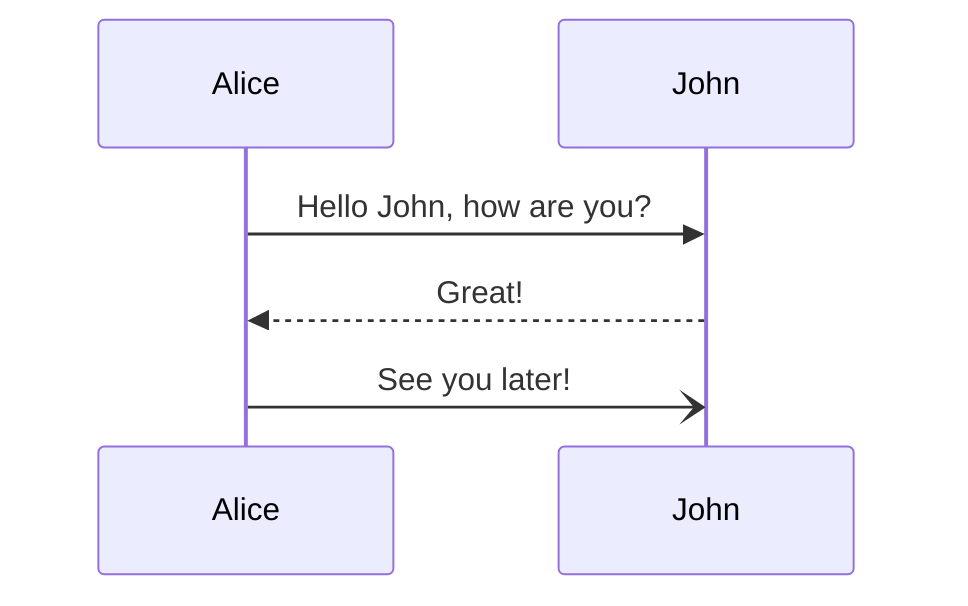

# git-playground
A playground repo you can use to try out git commands

In particular, you should be able to do the following:

1. Look, you can add bullet items.
2. You can add **Check lists**
3. You can do *tables* too.

> Note: You can use [mermaid](https://mermaid-js.github.io/mermaid/#/) syntax to draw rich diagrams.
> Make sure you use it -- a picture is worth ~~100~~ 1000 words. 
> You can write a note to draw attention to sidebar that does not go with the rest of the flow.

```
- [x] this is a checklist
- [ ] not yet done
```

That will render as:

- [x] this is a checklist
- [ ] not yet done

And, you can write code here too:
```python
def f(x):
  if x<=0: return 0
  return f(x-1) + x
```
The same way, you can create diagrams too:




👍 ( Emojis are fair game too!) 😄

And, you can add files too! (Not going to show how). 

For full details, you can always google: https://docs.github.com/en/get-started/writing-on-github 

