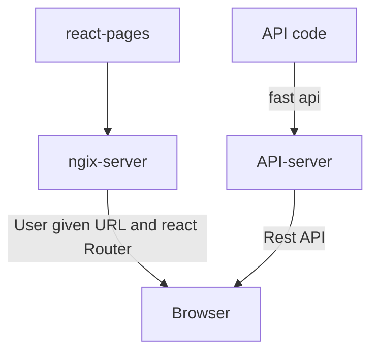
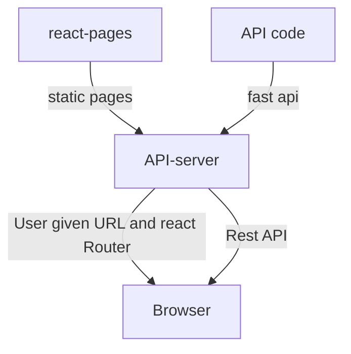
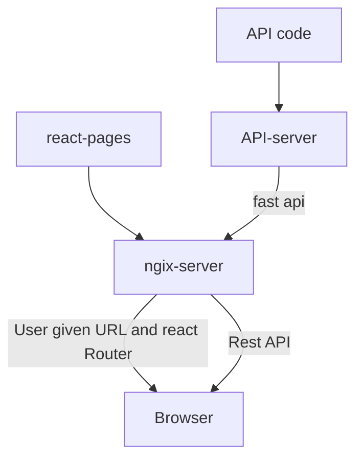

Lot of our apps have two components: reactjs component serving the pages and backend server serving rest API or graphQL API. Usually, we run two servers:




That increases the complexity of setup. We can simplify it as follows:

<div class="center">



</div>
That makes us need only one server, and one container making the code simpler. 

Btw, there is another way of simplifying it -- that is using nginx as reverse proxy for API server. In this scenario, this is what happens:

<div class="center">



</div>

# Setting up

1. Use Poetry to create your app. Here I did: `poetry new fastapi-with-static`
2. Change the README.rst to README.md as we use markdown format for writing.
3. Run the following `poetry add uvicorn fastapi typer`

# Writing code

Please check the code `server.py`. We have the API end points first and finally the static pages served out of static. The order is very important. If you put the static pages first, then none of the APIs work.

# Writing a command using typer and poetry

Instead of using `if __name__ == "__main__"` pattern, try the following:

1. create a function that runs the app. I used `run_app` function.
2. Now, create a command entry as another function. I used `main` function. All it does is `typer.run(run_app)`. 
3. Finally, in pyproject.toml, add the following:
```
[tool.poetry.scripts]
fastapiserver = "fastapi_with_static.server:main"
```
That is the module name, followed by the entry point.

Now, you can do poetry install. The command `fastapiserver` is available to you. Run it with `--help` argument to see how to get the help. Your function comment will become the help text.

# Testing the system

To test the system, you need to be in a location where there is a static folder. That folder is mounted at the root. Look for the static folder along with the code.

Here is what we are doing:

1. Serve index.html page with css and js
2. The app.js code invokes the backend API and gets the data and fills in the card.

What you can see is that we do not need to use CORS or any such mechanism. It simply works.

