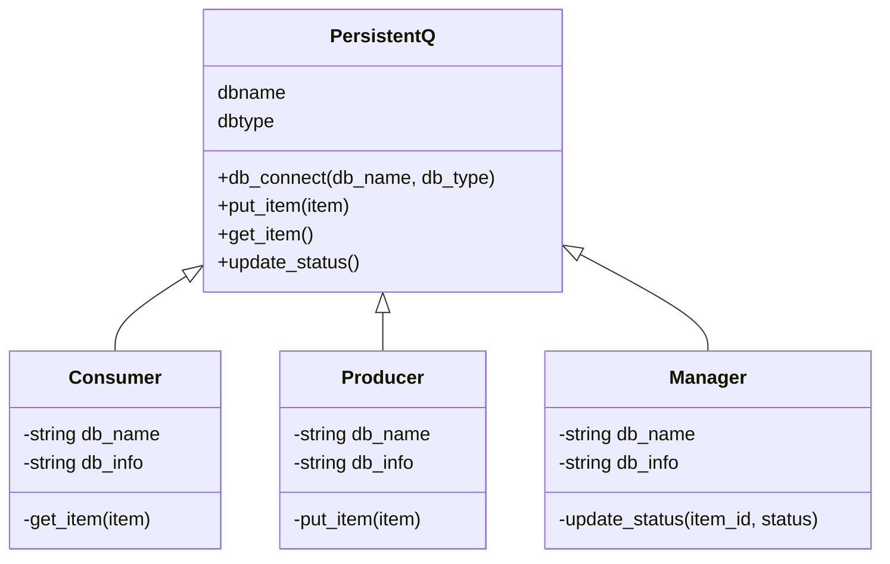
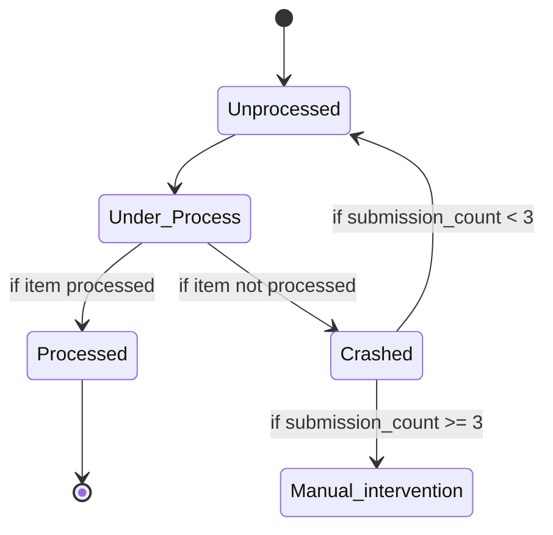

# Purpose
Persistent Queue manages the files produced by various producer programs and supply the generated files to the various Consumer programs in a conflict free mechanism. Pipeline to make sure the jobs submitted by producer are successfully processed by consumer.
If the jobs get crashed before successfully processing by consumer then the jobs are added to the queue again and pass to consumer


# Installation
How do we use install the code, library or whatever. What prereqs are needed

# How to use it

Producer: If a producer uses a Pq library then it uses `put_item` to write the generated file to write it in the sqlite3 table along with the timestamp

``` python
# Here is the psuedo code
pq = persistentQ({name: "db_name", type: "sqlite"})

# To submit the job
id = pq.put_item(item:str)

```

Consumer: If a consumer uses a Pq library and requests for the queued file using get_file() so it fetches the 1st record of the table. The consumer program should be idempotent process. 

``` python

# Here is the psuedo code
q = persistentQ({name: "db_name", type: "sqlite"})

# To get an item from the queue: 
while process_status is True:# Tries to fetch item from Q unless the consumer process is explicitly Terminated
  id, item = pq.get_item()
  if item is None:
    sleep(10)
  process(item)
  pq.update_status(id, STATUS) 
  
Questions to answer:
# How do we know if there are items in the Q?
q.get_item() checks the no. of records in the Q, returns None if no 'unporcessed' items in the queue or returns item
The consumer sleep(10) and try q.get_item() unless the process is terminated

```

Manager's job is to make sure that it clears the lingering records that are not processed over "n" minutes (customized via configuration):

``` python
q = persistentQ({...})
# We need to get all the items that are older than a specific duration -- that means that item is orphaned.
# We also want to specify the status of the item -- like under_process or whatever. For each such item,
       while self.terminate_manager is False:
           q.update_q(item_id,status)
            time.sleep(1000)

```

The Ops console:

``` python
q = persistentQ(...)

# To print the items
array_of_items_dict = q.get_all_items()

# To manually remove the items from the q
q.purge(duration, status=DONE)

```

# Basic Functions of Pq:
- get the item from the producer,q.put_item(item: str) inserts the item along with timestamp and status='unprocessed' and submission_count='0'
- upon request from the consumer, q.get_item() checks the no. of records in the q and returns the topmost unprocessed item, if available or none.
- updates the status of the item when q.get_item() is invoked or update_status(item_id: int, status: str) by the manager

# Model class diagram of Q: 


# State Diagram of all possible states of Item in Q:




