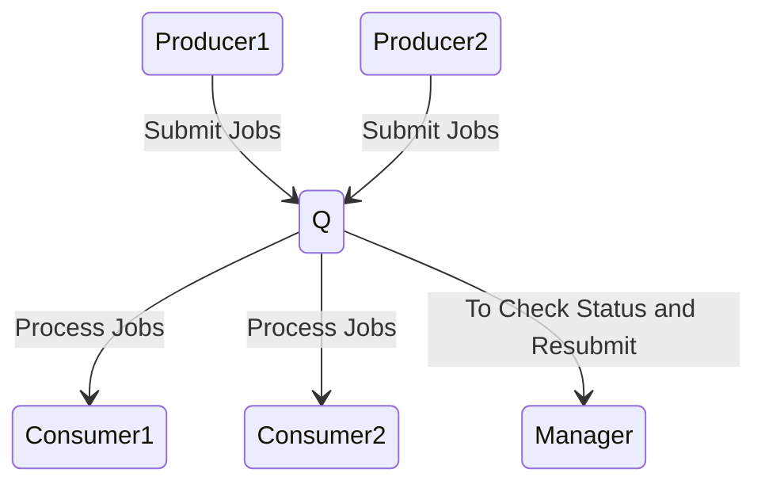
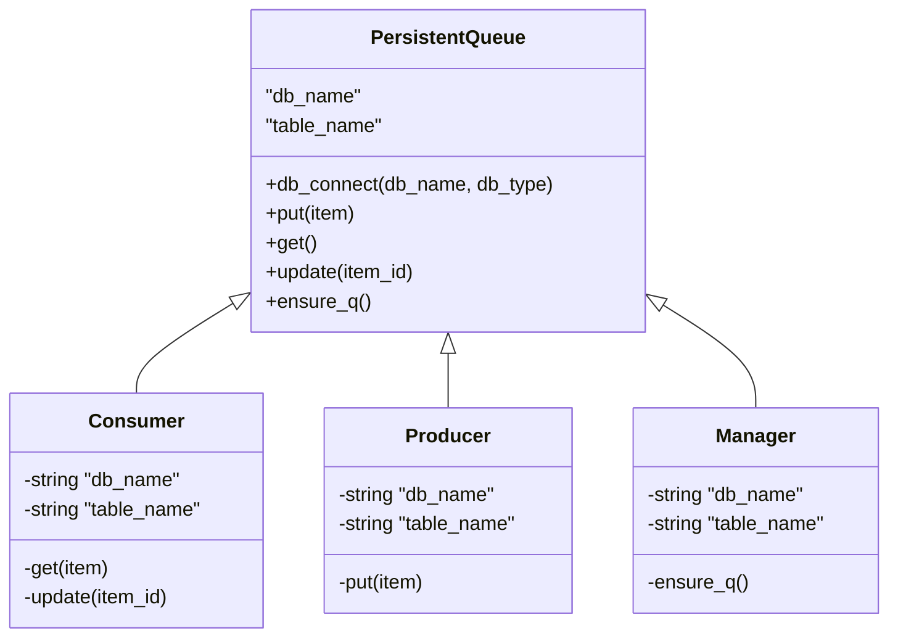

# Problem description

Imagine a system with producers and consumers. Producers produce items to be processed and submit to a Q. Consumers pick up from the Q and process the items. We need to provide the following functionality.  

1. The system should be robust. No item should be left unprocessed. As much as possible, no item should be reprocessed.
2. The system should support many producers and consumers.
3. The system should provide information on the items -- the status, the time taken to process etc.

Here is a diagram that depicts the system: 



- Producer1 and Producer2 produce jobs
- Consumer1 and Consumer2 consume jobs
- Manager: Checks the status for ever 1 hour and resubmits jobs if needed


# Installation
You can install this library using **'pip install atk-training-tamil-q-basic'** in your system. The library is in the https://dev-pypi.aganitha.ai/

# Usage

## API for the producer

Here is the way the Q is used by the producer:

To put an item in the Q

``` python
q = PersistentQueue("db_name", "table_name")
produce_items()
q.put(item)

```

## API for the consumer

Here is the way the Q is used by the consumer:

To get an item in the Q

``` python
q = PersistentQueue("db_name", "table_name")
q.get(item)
process_item()
q.update(item)

```
- The consumer will get the item, only if the status of the item is 'not_processed'
- When the consumer gets an item, it updates the status of that item to 'in_process'
- After processing the item, the consumer updates the item's status as "processed" or deletes the record(in our case deletes the record).
- If there are no items in the Q, the consumer will wait and check the Q after every 10 seconds
- Multiple consumers can access the Q simultaneously

# API for the manager

What if the consumer gets an item and crashes while processing the item. It would have set the status of the item to 'in_process' while getting it. Now when other consumer comes and looks for an item, this item will not be accessed as the status is 'in_process'. SO in that case, we have to put the item back in the queue. That's where the manager comes into play.


The manager will simply come and inspect the database every 1 hour and updates the record status to 'not_processed' if the time after the status of an item set to 'in_process' exceeds 1 hour


Here is how the manager works:

```python
q = PersistentQueue("db_name", "table_name")
q.check_and_change_status()
```

# Implementation


       
    


